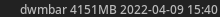
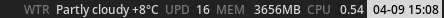

# dwmbar

A modular status bar setter for dwm, written in rust.

### Features

- Configured in the language it is written in

- Full hex color support*

- Custom refresh rates per module (or even module instance!)

- Easily extensible

*Note: requires [the status2d dwm patch](https://dwm.suckless.org/patches/status2d/)*

### Installation

The install.sh script copies the binary into /usr/local/bin. Simply run the binary as a process in your xinitrc/init script.

### Example configurations

The configuration can be found in the main.rs in the main function. This is the default configuration.

```rust
let modules: Vec<&dyn BarModule> = vec!{
    &Text { text: "dwmbar" },
    &Mem {
        format: "{used}",
        update_interval: 5,
        unit: MemoryUnit::MB,
    },
    &Clock {
        clock_format: "%m-%d %H:%M",
        update_interval: 1,
    },
};

let separator = " ";
```



A more complete configuration would look something like this.

```rust
let modules: Vec<&dyn BarModule> = vec!{
    &Color { background: None, foreground: Some("#787878"), },
    &Text { text: "WTR" },
    &Color { background: None, foreground: Some("#d8d8d8"), },
    &Wttr {
        format: "{weather}",
        location: "Warsaw",
        update_interval: 3600,
        wttr_format: "%C+%t",
    },
    &Color { background: None, foreground: Some("#787878"), },
    &Text { text: "UPD" },
    &Color { background: None, foreground: Some("#d8d8d8"), },
    &Updates {
        format: "{count}",
        update_interval: 7200,
        update_cmd: "checkupdates",
    },
    &Color { background: None, foreground: Some("#787878"), },
    &Text { text: "MEM" },
    &Color { background: None, foreground: Some("#d8d8d8"), },
    &Mem {
        format: "{used}",
        update_interval: 5,
        unit: MemoryUnit::MB,
    },
    &Color { background: None, foreground: Some("#787878"), },
    &Text { text: "CPU" },
    &Color { background: None, foreground: Some("#d8d8d8"), },
    &Cpu {
        format: "{load}",
        update_interval: 1,
    },
    &Color { background: Some("#d8d8d8"), foreground: Some("#000000"), },
    &Clock {
        clock_format: "%m-%d %H:%M",
        update_interval: 1,
    },
};

let separator = " ";


```

and would result in a bar looking like this



#### Planned features

- [x] Different refresh times for different modules

- [ ] Many more modules

- [ ] Async?

### Contributing

If you write a useful module or extend the programs existing functionality, feel free to send a pull request.
